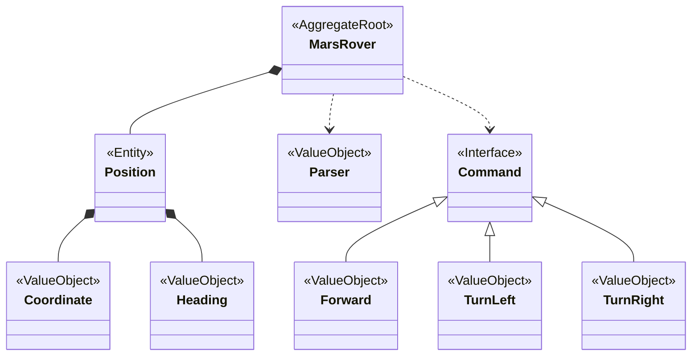
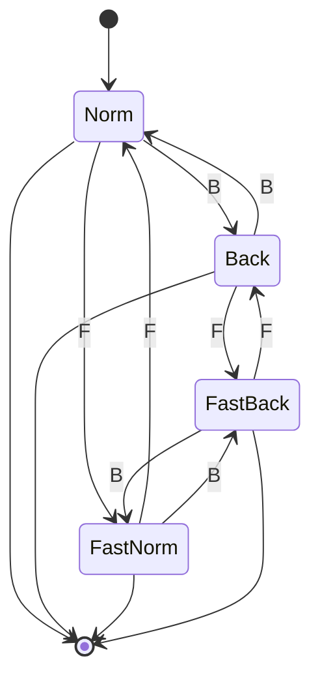
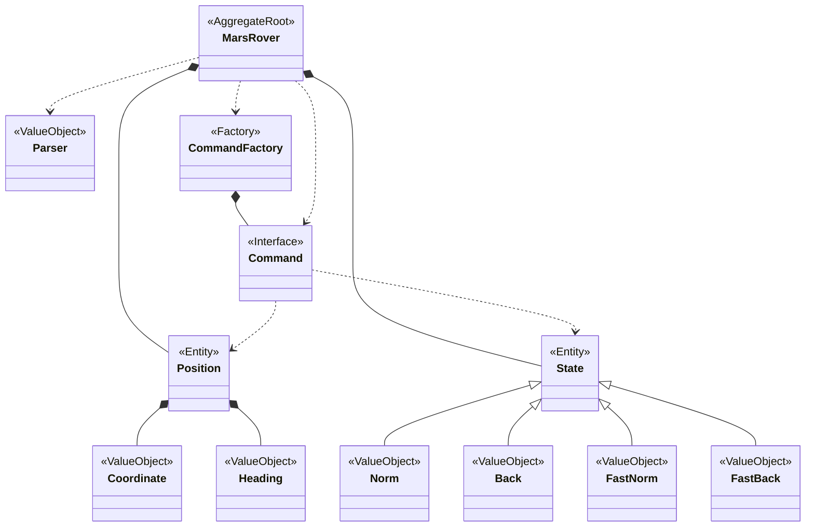
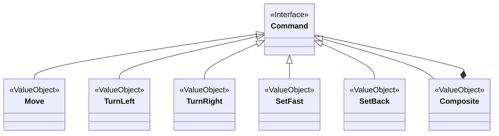
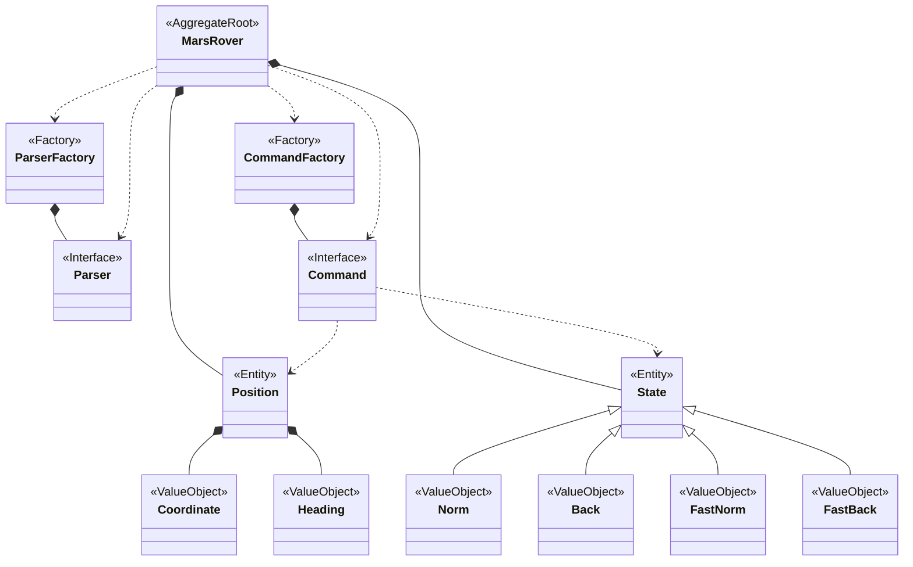
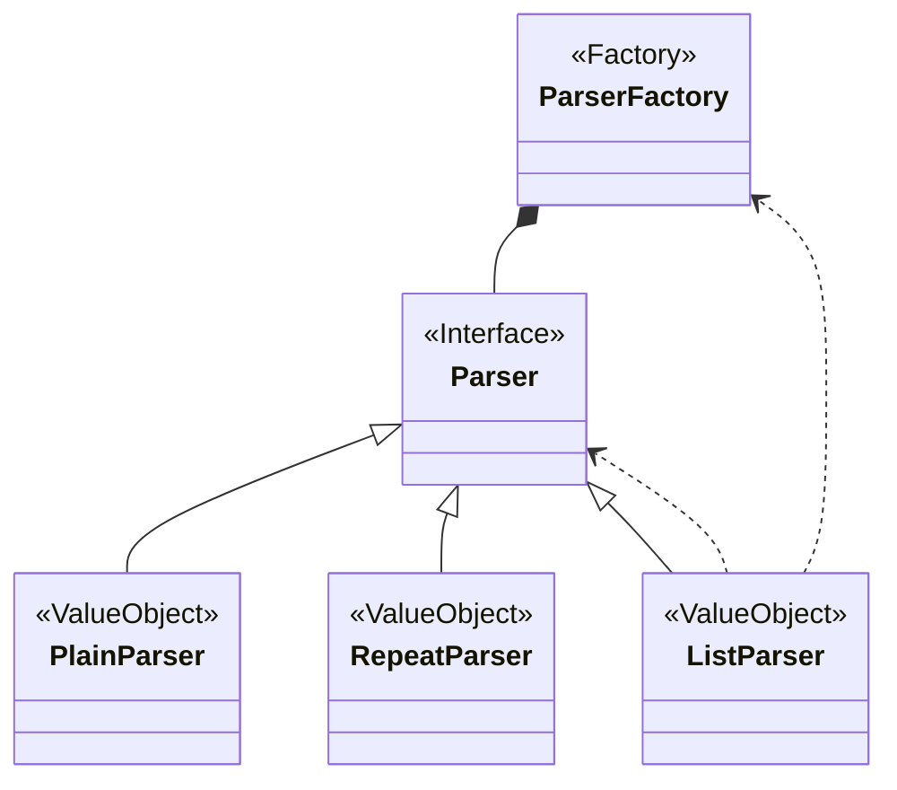
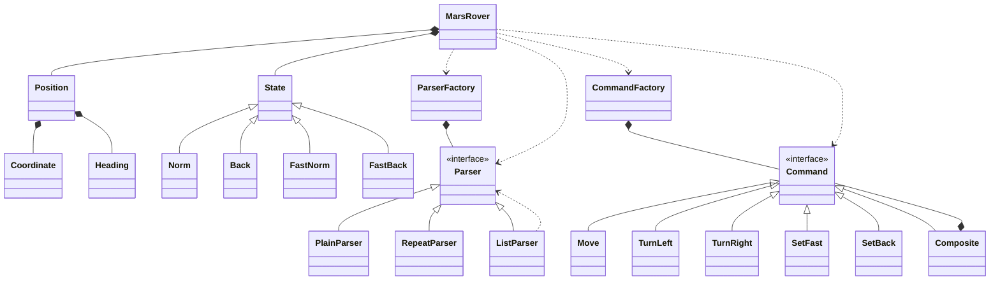

# Mars Rover

## 需求一

假想你在火星探索团队中负责软件开发。现在你要给登陆火星的探索小车模拟器编写控制程序，根据地球发送的控制指令来控制火星车的行动。

火星车收到的指令分为三类：

1. 初始化信息：火星车的降落地点（x, y）和朝向（N, S, E, W）信息（1 2 E）；
2. 移动指令：火星车可以前进（M），一次移动一格；
3. 转向指令：火星车可以左转90度（L）或右转90度（R）。

由于地球和火星之间的距离很远，指令必须批量发送，火星车执行完整批指令之后（1 2 E MLLR），再回报自己所在的位置坐标和朝向 (2 2 N）。



## 需求二

* 新加一个指令B：如果接受到B指令，那么就会进入倒车状态，这个时候M跟正向的时候是反的。注意，指令的操作虽然反了，但是朝向不能变。比如朝北的M之后，y坐标是减了，但是朝向必须还是北。
* 新加一个指令F：如果接收到F指令，车进入极速状态（本指令操作至此结束）。在极速状态下执行该操作指令：M会前进两格，L会前进一格然后左拐，R会前进一格然后右拐。
* 极速和倒车两个状态可以叠加，叠加后，M会倒退两格，L会倒退一格然后左拐，R会倒退一格然后右拐。
* 再接收一次B或者F指令，对应的状态会消失。







## 需求三

由于地球和火星之间的距离很远，指令必须批量发送，例如：1 2 E MLLR。

我们支持重复命令简化输入且对机械装置模块有好处，命令格式如下：

* `|{n}:{command}|`：repeat命令，将指定的指令重复执⾏n次； 
* `|command1,command2|`：command列表，按照顺序执⾏所有指令； 

```bash
1 2 E 4:MLMRML
1 2 E MLMRML,MLMRML,MLMRML,MLMRML
1 2 E MLMRML
```





## 总结

https://cyber-dojo.org/kata/edit/zn05a4



```bash
------------------------------------------------------------------------------
                           GCC Code Coverage Report
Directory: .
------------------------------------------------------------------------------
File                                       Lines    Exec  Cover   Missing
------------------------------------------------------------------------------
command_factory.cpp                           23      23   100%   
composite.cpp                                  7       7   100%   
composite.h                                    1       1   100%   
list_parser.cpp                                7       7   100%   
list_parser.h                                  1       1   100%   
mars_rover.cpp                                22      21    95%   42
mars_rover.h                                   1       1   100%   
mars_rover_tests.cpp                         115     115   100%   
move.cpp                                      15      15   100%   
move.h                                         1       1   100%   
parser_factory.cpp                            10      10   100%   
plain_parser.cpp                               2       2   100%   
plain_parser.h                                 1       1   100%   
position.cpp                                  29      29   100%   
repeat_parser.cpp                              5       5   100%   
repeat_parser.h                                1       1   100%   
set_back.cpp                                   3       3   100%   
set_back.h                                     1       1   100%   
set_fast.cpp                                   3       3   100%   
set_fast.h                                     1       1   100%   
state.cpp                                      8       8   100%   
state.h                                        1       1   100%   
string_utils.cpp                               5       5   100%   
turn_left.cpp                                  4       4   100%   
turn_left.h                                    1       1   100%   
turn_right.cpp                                 4       4   100%   
turn_right.h                                   1       1   100%   
------------------------------------------------------------------------------
TOTAL                                        273     272    99%
------------------------------------------------------------------------------
```

